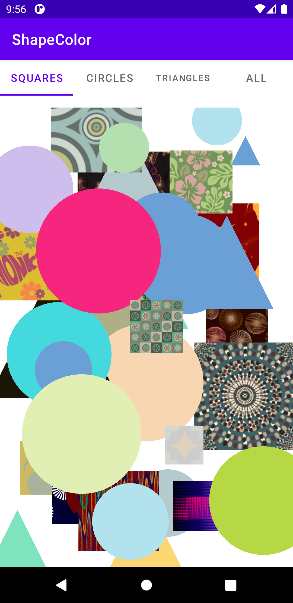

# ShapeColor
This application will demo an MVVM Android structure

# Overview
This is code sample for generate shape with random color.
- User can create infinite number of squares, triangles or circles filled with random colours or images
- User can clear the shape items by phone shaken

# Completed:
1. A user should be able to spawn an infinite number of squares or circles filled with random colours or images.
2. Application consists of 4 screens using a tab bar. The tabs are as follows:
  - Squares - this screen only spawns squares.
  - Circles - this screen only spawns circles.
  - Triangles - this screen only spawns triangles.
  - All - this screen spawns squares, circles and triangles randomly.
3. Create squares, circles or triangles which randomly fill with random colours or images when the user taps on the main background.
4. Created shapes are placed at the user's tapped location.
5. Create a shape at a random size within appropriate ranges. A shape is not more than 45% the width or height of the screen size and never less than 10% the width or height.
5. Fill circles with a colour that is generated by calling the API from http://www.colourlovers.com/api/colors/random?format=json using either the RGB or Hex value
6. Fill squares with an image that is generated by calling the API from http://www.colourlovers.com/api/patterns/random?format=json using the imageUrl value
7. Fill triangles randomly color from above.
8. If no connection is available from the above API urls, use code to generate random colours
9. Double tapping the shape replaces the colour or image based on the above mentioned rules.

10. Extras:
 - When a user taps the screen, add an animation for the shapes that appear
 - Remove all shapes when shaking the device
 - Be able to move a shape around
 
# Screenshots
 
 
 
# Technologies
- Android Kotlin
- Applying Android MVVM Architecture Components
- Android Material Design
- Retrofit2
- Glide

# Installation Guide (Windows, MacOS, Linux)
- Download/Clone the code.
- Download Android Studio https://developer.android.com/studio to open project
- Open project and Open an Existing Project
- Take time to waiting for Android Studio import library and initiations.
- Connect your Android Device or Emulator (make sure you have already opened the debug mode on your device)
- Click Run button on Android Studio to install app.

